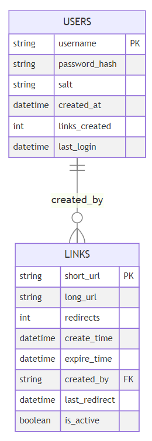

# URL Shortener
> Using Fastapi, SQLModel, SQLite

May take a while to start the server (I am using free tier plan)

#### Overview
read/write ratio should be 100/1
should be able to scale-up
short url key length: 8

### Shortener method?
1. random id or uuid
- collision may happen when scale up
- need to check frequently to prevent collisions -> bottleneck
- random is not secure (pseudo random)

2. hashing(md5, sha...)
- truncate by taking first n characters may cause collision 

3. counter (token range)


-> bcrypt + base62 approach

### Database


### Setup and Installation

1. **Clone the repository**

   You can clone the repository by running the following command in your terminal:

   ```shell
   git clone https://github.com/patty111/url-shorten.git
   cd url-shorten
   ```

2. **Install dependencies**
`pip install poetry && poetry install --no-root`

3. **Run**
`uvicorn main:app --port 8000 --reload` or `python3 main.py`

> navigate to `/docs` endpoint for API documentation

### Tests
